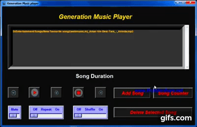

## 
 ***_Introducing My New Project Generation Music Player_*** 

---
### 
💡 ***_This is a Multi-Functioning Music Player, a Basic Project in Python_*** 💡

### ➡️ ***_<u>Features are:-</u>_***
- #### ***_Play Song_*** 
- #### ***_Pause Song_*** 
- #### ***_Mute a Song_*** 
- #### ***_Play Next Song_*** 
- #### ***_Play Previous Song_*** 
- #### ***_Shuffle_*** 
- #### ***_Repeat_*** 
- #### ***_Add Songs to the Playlist_*** 
- #### ***_Count the Total Song in the Playlist_*** 
- #### ***_Live Song Duration_*** 
- #### ***_Shortcut Key to take Control Easily_*** 

---

### 💻 ***_<u>Shortcut Key for Easy Control:-</u>_*** 
- ### ***_<u>Functionality-------Shortcut Key</u>_***
- #### ***_Next Song---------------->Right Arrow Key_***
- #### ***_Previous Song---------------->Left Arrow Key_***
- #### ***_Pause Song--------------------->Spacebar_***
- #### ***_Play Song After Pause--------------------->Spacebar_***
- #### ***_Stop Song--------------------->ESC_***
- #### ***_Delete All Song --------------------->Del_***

---

### ⚒️ ***_<u>Python Module Used Here:-</u>_*** 
- #### ***_Tkinter_***
- #### ***_Pillow_***
- #### ***_Time_***
- #### ***_Pygame_***
- #### ***_Mutagen_***

---
### 
 ***Made By Rishita***

